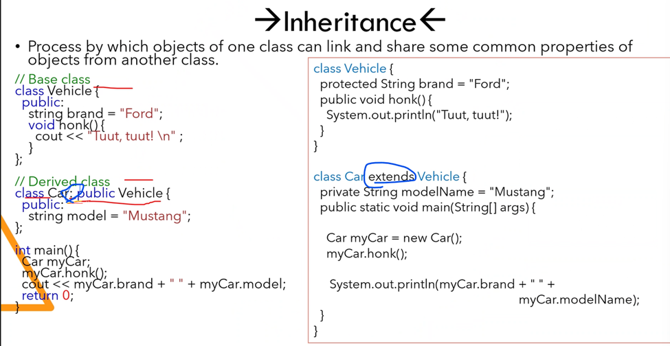
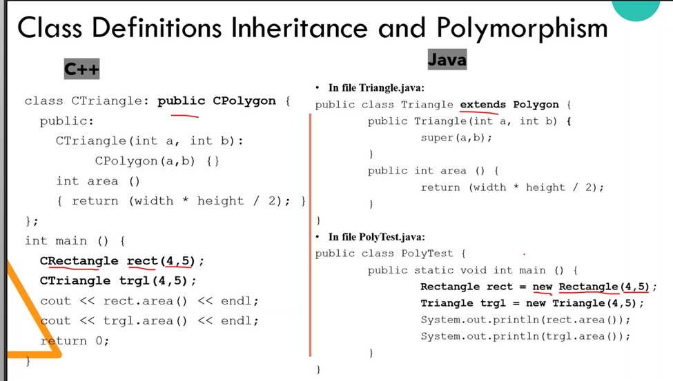
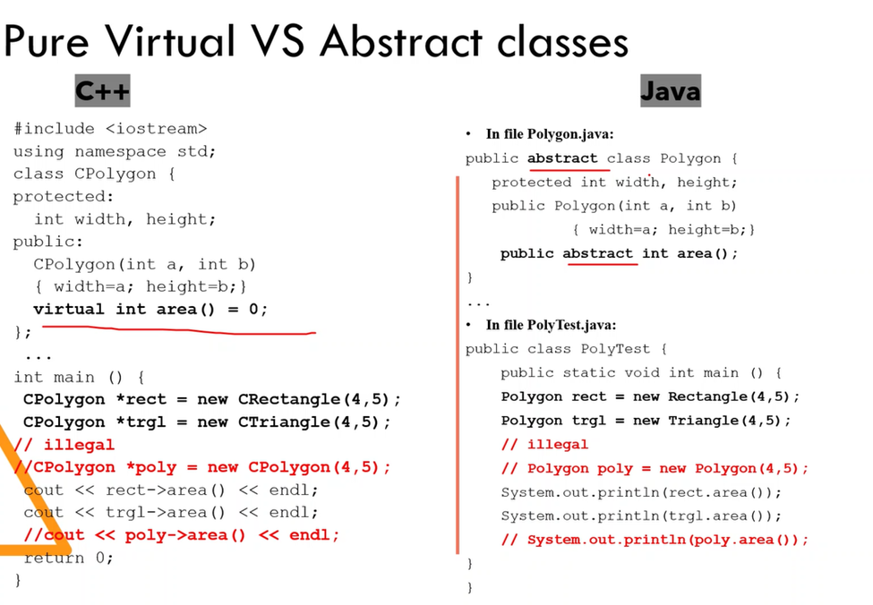
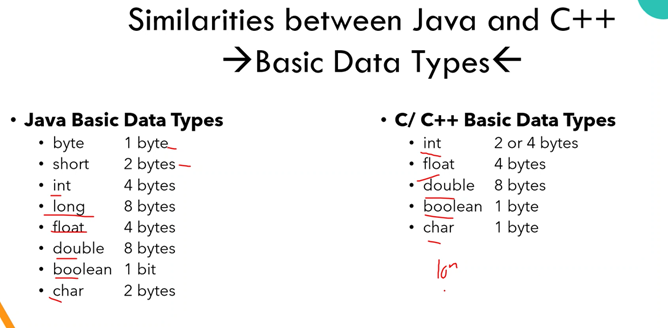

# Differences that I can see so far

## Compiling and Running are different

C++:
Source Code -> Assembly Code -> Machine Code -> Execution

Java SE:
Source Code -> build into bytecode(from .java to .class) -> JVM(interpreter) load bytecode. -> Internal Integrity Check -> Execution

So Java is an interpreted language, but C++ is not.

## Java is a pure OOP language (Just like C#)

That's why we have this here

```java

public class Hello
{
    // A typical Java entry point funciton //
    // You can see even a entry point function //
    // It must be a class function inside a class //
    public static void main(String[] args)
    {
        int a = 5; 
        int b = 10;
        if(a>b){
            System.out.print(a)
        }    
        else{
            System.out.print(b)
        }
        
    }
}

```

Compared to C and C++, it is indeed more words to put down. Just like the framework I used in js/ts nest.js. You will have to put down a lot of boilerplate codes. But, the good thing is with the team size growing bigger, the code base is still manageable. If it is written in C or C++, you need a strong leader for the project to tell the juniors how the workflow runs.

## Class Inheritance syntax is different

C uses: to inherit

### Java uses extends to inherit



### Java, you have to use **New ClassName(ConstructorArgs...)**



### Java use **abstract** declare abstract class and virtual function



## More Differences

### Java uses different primitive types



### Java has no pointers

(To be continued)
