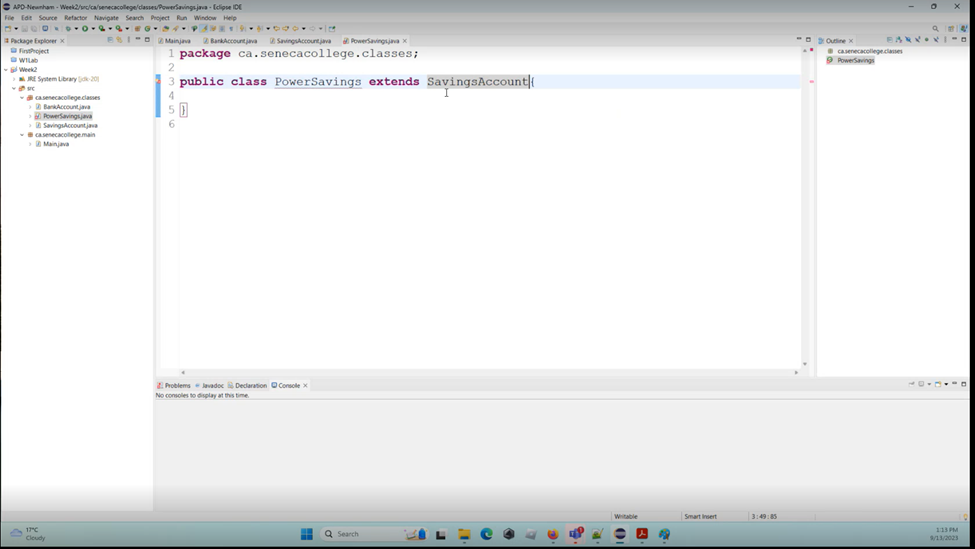

# Detail walk through about Java Inheritance

## In C++, default access is private, but in java default is public

Also you notice that there can be private / public classes in Java, not in C++ though.

Private members 90% chance should have the getter setter, and they can be created by using the auto-gen from the IDEs.

Example of Getter and setter + a default constructor

## Constructor is the right place to initialize the member attributes

## In C++ you use class a : b , in Java you use accessKeyWord class a extend b

## Even the SavingAccount class has nothing, you can still invoke the BankAccount’s behaviors on this class

That is pretty normal in any OOP language.

## **Super** is the way to call the parent class object’s method, if the parent has 2 constructors, you have to choose one of them to invoke.  (Super can also call parent’s class’s methods.)

This is totally different than C++

## Override parent's class's function is also easy using **@Override**

Also you should notice that super.methodName() will invoke the parent class’s method in the child class’s method

## With another layer of inheritance

It is already giving you issues because your parent class used the pass argument constructor. So this child class must have that pass argument constructor.

To fix it simply declare an explicit constructor.

The following is the chain of the inheritance and using super keyword.

The super.withdraw(number) will find its immediate parent class and find out if there is a method called withdraw. IF there is no, it will go one level higher, and check if there is a withdraw() implementation.

So even the SavingAccount does not have withdraw implemented, we can still use super to reach it’s grandpa BankAccount’s withdraw().

## super and this sometimes don't work well

Super inside the constructor must be on the first line. Before you use this.memberName

## Abstract class and abstract (virtual) function

Like in any coding languages, you can not just declare an instance from the abstract class or interface.

In C++, you will need virtual function inside the class.

In Java, you also need virtual function but in this way.

Like all virtual functions definition, it can not have a body inside.

## Inherit from a abstract class

Depending on the current class, if this class will be an abstract class, then you just extends like normal.

But you want to have a class for instantiating object, then you will need to override the virtual function from the parent class.

