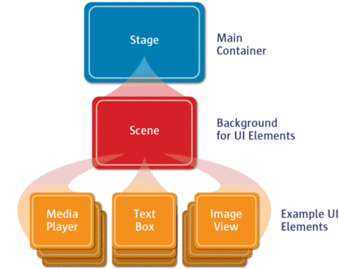
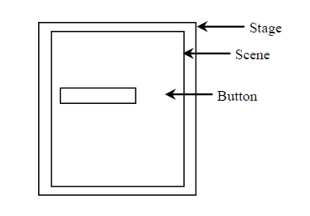
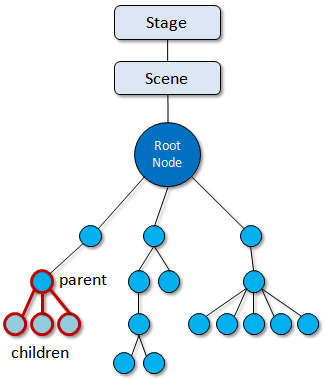
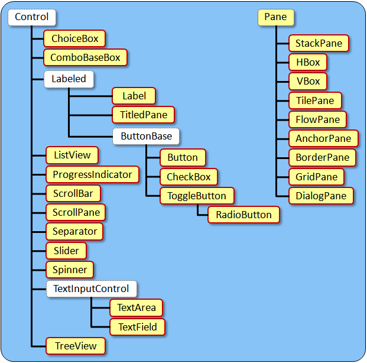
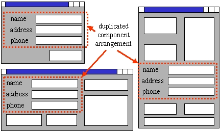
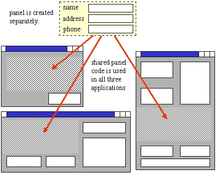

# Java FX, User Interface, and events.

## User Interface

All applications require UI which allows the user to interact with the program.

Think about ATM, sometimes the UI has physical components. Also, users could expect the UI to take in information and visual or audible information.

Think about Online banking, apps nowadays are often running on a web browser, and the interactions are done via the virtual buttons, text fields, etc.

## Model vs User Interface 

### Model

The model of an application contains classes that represent the business logic.

The model is always developed separately from the user interface.

It should not assume any knowledge about the user interface at all.

### User interface

The user interface is the part of the application that is attached to the model which handles interaction with the user and does NOT deal with the business logic.

The user interface makes use of the model classes and often causes the model ot change according to user interaction.

The changes to the model are often reflected back on the user interface as a form of immediate feedback.

## GUI graphical user interface

This is a user interface that makes use of one or more windows to interact with the user.

A good GUI presents a user-friendly mechanism for interacting with an app.

A GUI gives an app a distinctive "look and feel"

GUIs are built from GUI components - controls or widgets.

A GUI component is an object with which the user interact via the mouse, the keyboard or another form of input.

**it is always important to understand that there should always be a separation in the code between the model classes and the user interface classes.** With the separation in the code, it allows us to share the same model classes with different interfaces.

## Application

A computer program with a GUI which can interact with user to perform tasks & calculations, obtain & visualize information, and potentially interact with the real world through sensors and hardware.

## JavaFX (a GUI api for developing client applications)

1. A typical structure





```java
import javafx.application.Application;
import javafx.scene.Scene;
import javafx.scene.control.Button;
import javafx.stage.Stage;

public class JavaFXBasic extends Application {
    @Override // Override the start method in the Application class
    public void start(Stage primaryStage ) {
        // Create a button and place it in the scene
        Button btOK = new Button("OK");
        Scene scene = new Scene(btOK, 200, 100);
        primaryStage.setTitle("JavaFX Basic Structure"); // Set the stage title
        primaryStage.setScene(scene); // Place the scene in the stage
        primaryStage.show(); // Display the stage
    }

    /**
     * The main method is only needed for the IDE with limited
     * JavaFX support. Not needed for running from the command line.
     */
    public static void main(String[] args ) {
        launch(args);
    }
}
```

1. Explain the important components of JavaFX

- Stage:
  The **window** of a JavaFX app's GUI is displayed.

- Scene:
  The stage contains one active scene that defines the GUI as a scene graph. (It looks like HTML's tree data structure)

- Window component:
  A window component is an object with a visual representation that is placed on a window and usually allows user to interact.
  
  AKA control objects. (like buttons, textFields)
  
  Components are often grouped together(by pane)

- Node:

  Each visual element in the scene graph is a node.

- Container:
  
  Is an object that contains components and/or other containers.

  Like the Pane class and its sub-classes, they are used to automatically manage the layout of the window components.

- Layout containers

  Nodes that have children are typically layout containers that arrange their child nodes in the scene.

- Controls

  Are GUI components like labels, textFields, buttons.

- Event handler

  A method that responds to a user interaction.

1. Scene and Scene Graph

The scene is arranged as a tree-like graph containing Node objects.

Scene graph begins with a root node.



1. Window Components

All window components actually keep pointers to their parent.

Parents keep pointers to their children, and we can access these using the parent's getChildren().

c <-> p (no wonder it is called Scene Graph instead of tree).

A list of window components:



1. Organizing Components

To reuse the components in different windows, pane is used to contain the components and then placed onto the window.

By creating separate pane objects to contain groups of components, you can move the pane around as well (so less codes to move the components around).

Panes can be nested.





1. Event

The term event is used to describe an occurrence of interest.

In a GUI application, an event is an occurrence of a user interaction with the application. 