# Panes, Menus, Dialog Boxes

## Layout Pane

Intro:

JAVA FX provides a mechanism called a Layout Pane that allows the automatic arrangement (i.e., "laying out") of the components of an application as the window is resized.

Benefits:

No manual setting pref sizes because the elements will be resized automatically.
UI will appear nicely cross the platform.

Each layout defines methods necessary for a class to be able to arrange Components within a Container.  And there are some examples in JavaFX called, FlowPane, BorderPane, HBox etc.

### FlowPane(simplest layout pane)

It is commonly used to arrange a few elements on a pane.

If no space remains on the current line, component flows to the next line.

The height of each line is the maximum height of any components on that line.

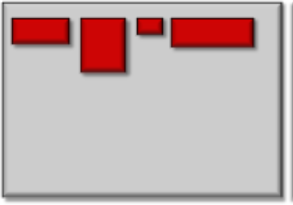

You can set the gaps between components by using setVgap().

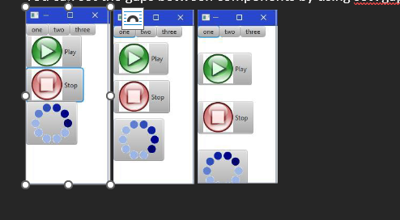

And yeah, setHgap() will specify the horizontal gap that we want to leave between each columns of components.

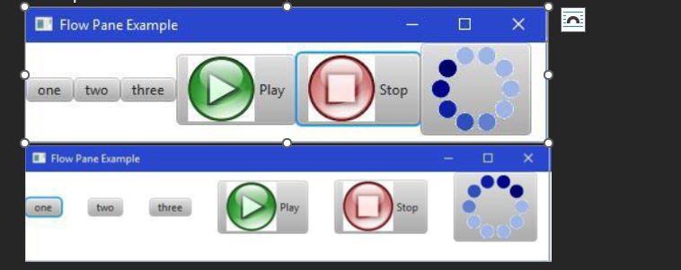

setPadding() can specify the gaps around the border of the frame and the elements.

Example:
    aPane.setPadding(new Insets(25,0,0,25));
    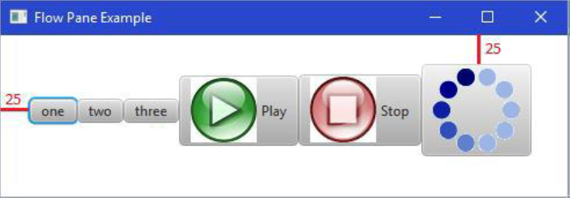

### HBox/VBox(The simplest component to use)

Like flow pane, either one after one vertically or horizontally.
It does not have wrap around effect.

Hbox

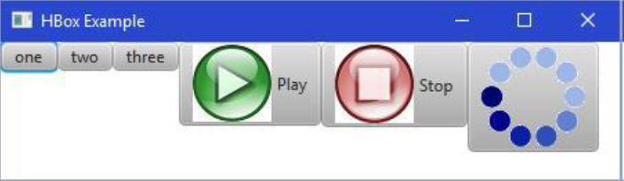

Vbox

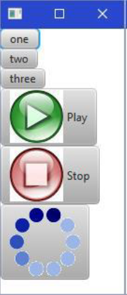

Also, just like CSS you can set up margin, paddings, an spacing

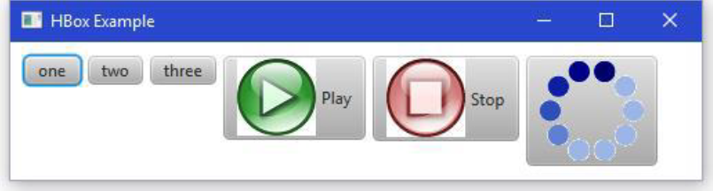

### Border Pane

Instead of re-arranging components, it allows you to place components at one of five anchored positions on the window:

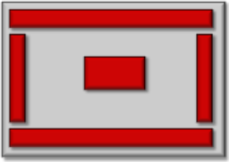

When the window resizes, components stay anchored to the side of the window.

This component will grow accordingly.

One component can be placed in each 5 anchored positions. But this one component may be a container such as another pane that contains other components inside of it.

Like this is a typical design.

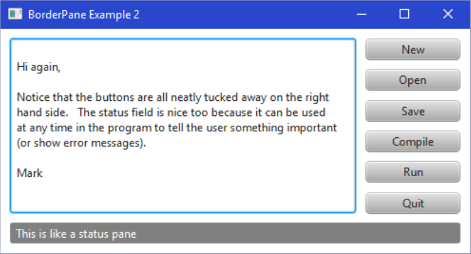

### Grid Pane

A GridPane is excellent for arranging a 2D grid of components.

It automatically aligns with components into rows and columns.

Components are added by specifying their columns and row in the grid.

Java determines the number of rows and columns to use for the grid by considering all of the.

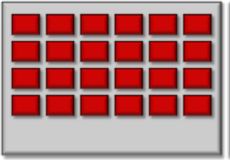

Again we can use setHgap, setVgap, and setPadding for adjusting the spacing.

## Menu

A menu is a list of commands presented to the user based on the request.

Menus can be attached to a menu bar at the top of an application, or they may be pop-up menus that appear anywhere on the screen.

Menu bar is attached to the main application pane as well as the contextMenu.

The individual menus are then added to the MenuBar or to another menu to from a cascaded menu.

Menu class contains menuitems objects.

Menu Items:

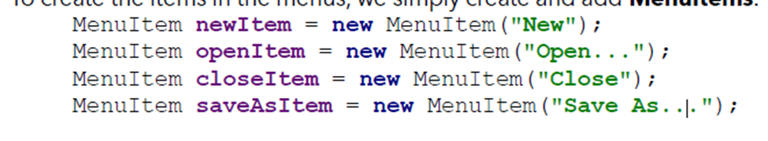

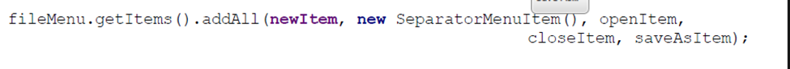

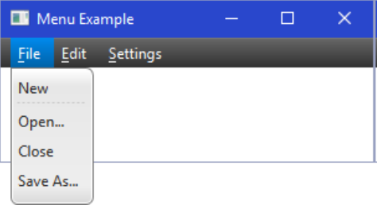

Also, you can set the items disabled. And you can also set the hot keys.

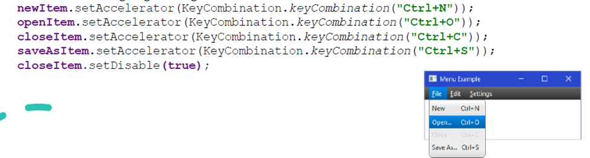

You could have Radio buttons and toggle groups in the menu.

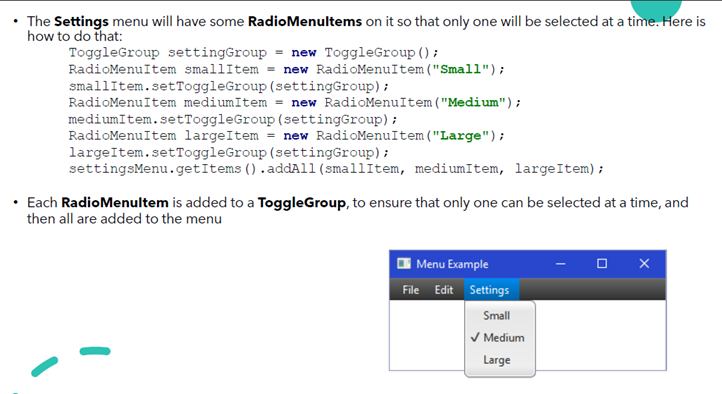

Same as the check list

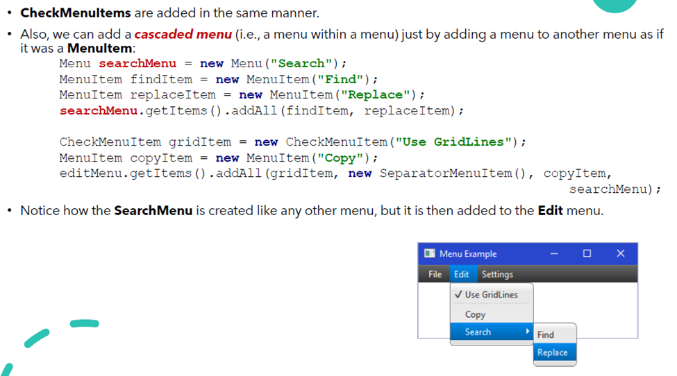

Also, a context menu will pop up wherever we right click the pane.

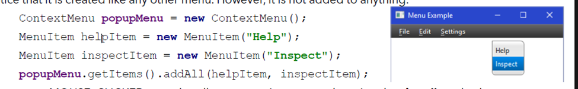

Also you need to subscribe the event:

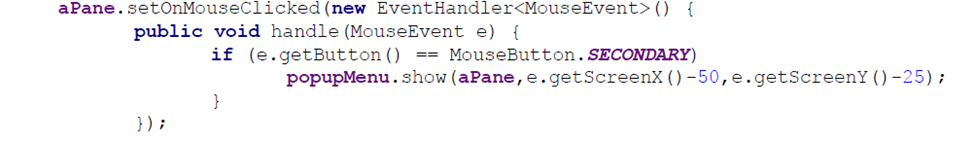

A little bit off from the mouse location which will help the user find out the mouse location.

## Dialog box

A dialog box is a secondary window that is used to interact with the user.
Usually either display or obtain or display additional information.

### Pre-made dialog box

#### Alert

a. Information box

```java
Alert alert = new Alert(Alert.AlertType.INFORMATION);   // creating
alert.showAndWait();                                    // let the window popped up, and the program wait for it

```

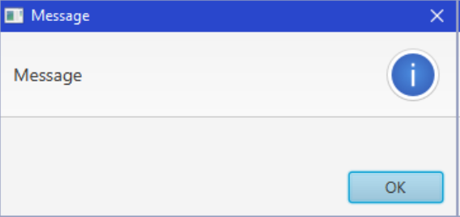

Also, you could have more contents inside the alert.

```java

alert.setTitle("Message To the User");
alert.setHeaderText("Important Reminder");
alert.setContentText(
"If you inserted a USB flash drive, make sure " +
"to take it with you when you leave. Some " +
"students have been forgetting their USB drive" +
" in the lab only to find that it is not there" +
" when they come back to look for it.");

```

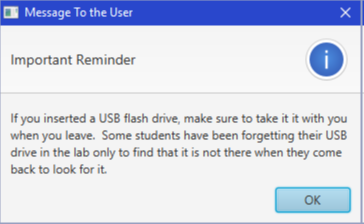

Or If you think the header text is dumb, you can use

```java
alert.setHeaderText(null);
```

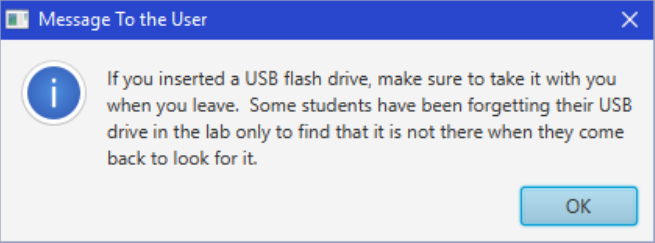

b. Warning box

You can change the icon from being an "information" icon to that of being a "warning" icon or an "error".

```java
Alert alert = new Alert(Alert.AlertType.WARNING); // here changed
alert.setTitle("Tip for the day");
alert.setHeaderText(null);
alert.setContentText("Don't eat yellow snow.");
```

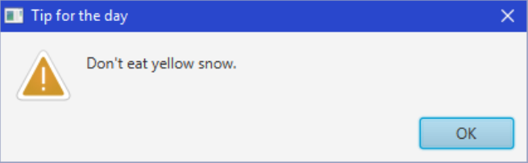

c. Expandable error box:

Take a few step ahead, we have a gridpane with a label. And a text area.

```java
Alert alert = new Alert(Alert.AlertType.ERROR);
alert.setTitle("Error"); alert.setHeaderText(null); 
alert.setContentText("Invalid Gregorian Calendar Date");
Label label = new Label("Date entered:");
TextArea textArea = new TextArea(new GregorianCalendar().toString()); 
textArea.setEditable(false); textArea.setWrapText(true); 
textArea.setMaxWidth(Double.MAX_VALUE); 
textArea.setMaxHeight(Double.MAX_VALUE);
GridPane.setVgrow(textArea, Priority.ALWAYS);
GridPane.setHgrow(textArea, Priority.ALWAYS);
GridPane expandableContent = new GridPane(); 
expandableContent.setMaxWidth(Double.MAX_VALUE); 
expandableContent.add(label, 0, 0);
expandableContent.add(textArea, 0, 1); 
alert.getDialogPane().setExpandableContent(expandableContent);
```

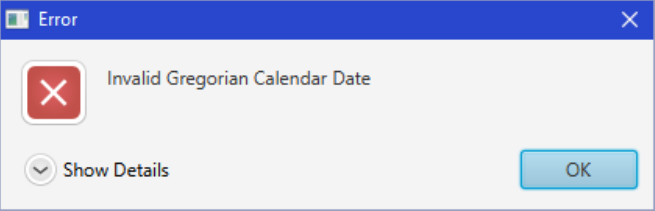

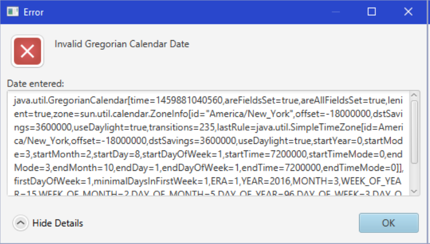

d. Dialog boxes can take user input as decisions:

```java
Alert alert = new Alert(Alert.AlertType.CONFIRMATION);
alert.setTitle("Answer this Question");
alert.setHeaderText(null);
alert.setContentText("Do you want me to clean up your hard drive ?");
// Here is how the program gets the result from the user. 
Optional<ButtonType> result = alert.showAndWait();

if (result.get() == ButtonType.OK){
    System.out.println("OK, I'm erasing it now ..."); 
}
else {
    System.out.println("Fine then, you clean it up!");
}
```

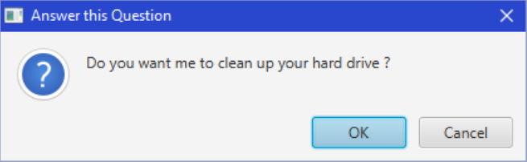

e. Choice Dialog

```java
String[] options = {"Apple", "Orange", "Strawberry", "Banana", "Peaches"}; 
ChoiceDialog<String> dialog = new ChoiceDialog<String>("Peaches", options); 
dialog.setTitle("Fruit Information");
dialog.setHeaderText(null); 
dialog.setContentText("Choose your favorite fruit");
// Notice here is the string instead of an element type 
Optional<String> result = dialog.showAndWait(); 
// is Present is the way to find out weither the user select an item or pressed cancel
if (result.isPresent()){ 
    System.out.println("Your choice: " + result.get()); 
} 
```

f. TextInputDialog:

```java
TextInputDialog dialog = new TextInputDialog("Mark");
dialog.setTitle("Input Required"); 
dialog.setHeaderText(null); 
dialog.setContentText("Please enter your name:");

Optional<String> result = dialog.showAndWait();
if (result.isPresent()){
    System.out.println("Your name is: " + result.get());
}

```

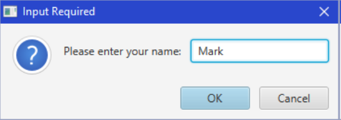

A throughout example:

```java
Dialog dialog = new Dialog();
dialog.setTitle("Login Dialog");
dialog.setHeaderText(null);
// This is making the logging button like ok //
ButtonTypeloginButtonType= new ButtonType("Login", ButtonBar.ButtonData.OK_DONE); 
// You don’t actually have to code again for cancel. 
dialog.getDialogPane().getButtonTypes().addAll(loginButtonType, ButtonType.CANCEL);

```

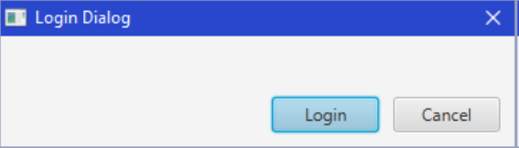


Then use the GridPane to hold the elements: 

```java
GridPane grid = new GridPane();
grid.setHgap(10); grid.setVgap(10);
grid.setPadding(new Insets(10, 10, 10, 10));
TextField username = new TextField(); 
username.setPromptText("Username");
// This field will hide all the entry
PasswordField password = new PasswordField();
password.setPromptText("Password");
grid.add(new Label("Username:"), 0, 0); grid.add(username, 1, 0);
grid.add(new Label("Password:"), 0, 1); grid.add(password, 1, 1);
dialog.getDialogPane().setContent(grid);
```

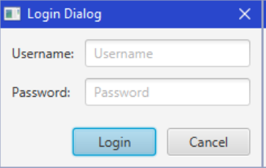

Handle login here:

```java

Optional result = dialog.showAndWait();
if (result.isPresent()) {
System.out.println("Username = " + username.getText() + ", Password = " + password.getText());
}

```

Behavior logics here

```java
// Convert the result to a Pair containing the username and password 
dialog.setResultConverter( new Callback<ButtonType, Pair<String, String>>()
{
    public Pair<String, String> call(ButtonType b) {
    if (b == loginButtonType) { 
    return new Pair<String,String>(username.getText(), password.getText());
    }
    return null;
    }
});

Optional<Pair<String, String>> result = dialog.showAndWait();
if (result.isPresent()) {
    System.out.println("Username = " + result.get().getKey() + ", Password = " + result.get().getValue());
}

// This solution above will make the dialog box returns key value pairs when the login button clicked.
// getKey(), getValue() to access key or the value of the pair. 

// Adjust this on the UI class// 
//This will let the dialogue box shows when the window popped up. 
username.requestFocus();

// Enable/Disable login btn depending on whether username was entered.
Node loginButton = dialog.getDialogPane(). lookupButton(loginButtonType);

loginButton.setDisable(true); // Disable upon start

username.textProperty().addListener(new ChangeListener() {
    public void changed(ObservableValue observable, Object oldValue,
    Object newValue) {
        loginButton.setDisable(((String)newValue).trim().isEmpty());
}
});
```

Another example about the File chooser dialog box:

```java
public class FileChooserTestProgram extends Application {
    private MenuItem openItem, saveItem;
    public void start(Stage primaryStage) {
        VBox p = new VBox();
        Scene scene = new Scene(p, 300, 100); // Set window size
        // Create the File menu
        Menu fileMenu = new Menu("_File");
        openItem = new MenuItem("Open"); openItem.setAccelerator(KeyCombination.keyCombination("Ctrl+O"));
        saveItem = new MenuItem("Save"); saveItem.setAccelerator(KeyCombination.keyCombination("Ctrl+S")); fileMenu.getItems().addAll(openItem, saveItem);
        openItem.setOnAction(new EventHandler<ActionEvent>() {
        public void handle(ActionEvent e) {
            // Choosing files by using the class// 
            FileChooser chooser = new FileChooser();
            chooser.setTitle("Open Data File");
            File f = chooser.showOpenDialog(primaryStage);
            if (f != null) {
                System.out.println("File chosen to open: " + f.getName());
                System.out.println("File with full path: " + f.getAbsolutePath());
            }
        }})
    }
}
```

