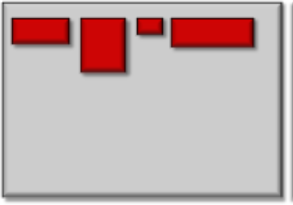
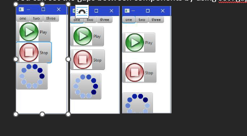
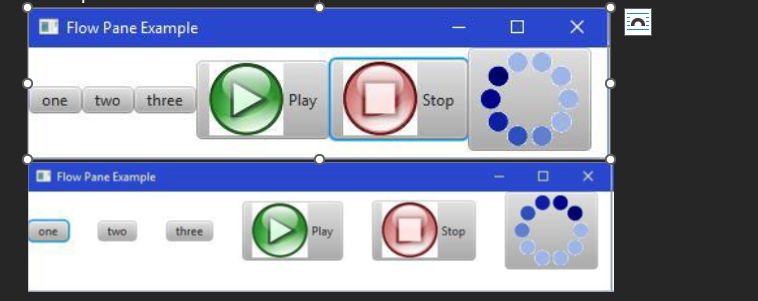
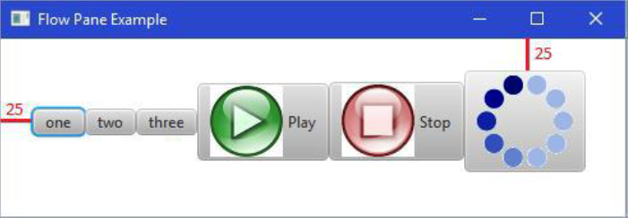
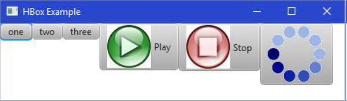
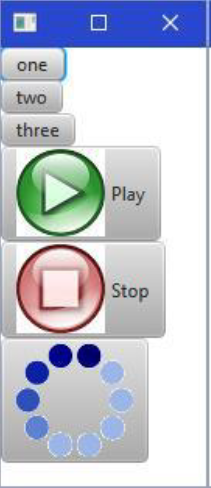
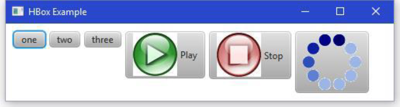
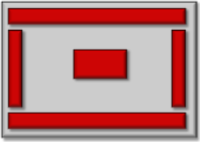
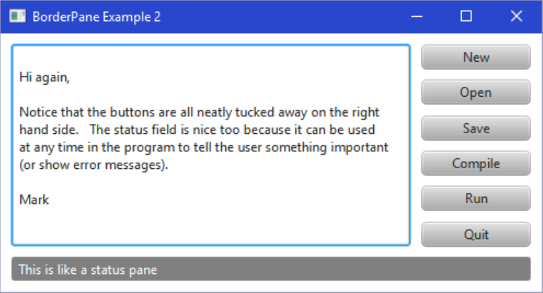
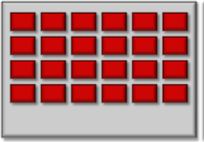

# Panes, Menus, Dialog Boxes

## Layout Pane

Intro:

JAVA FX provides a mechanism called a Layout Pane that allows the automatic arrangement (i.e., "laying out") of the components of an application as the window is resized.

Benefits:

No manual setting pref sizes because the elements will be resized automatically.
UI will appear nicely cross the platform.

Each layout defines methods necessary for a class to be able to arrange Components within a Container.  And there are some examples in JavaFX called, FlowPane, BorderPane, HBox etc.

### FlowPane(simplest layout pane)

It is commonly used to arrange a few elements on a pane.

If no space remains on the current line, component flows to the next line.

The height of each line is the maximum height of any components on that line.

You can set the gaps between components by using setVgap().

And yeah, setHgap() will specify the horizontal gap that we want to leave between each columns of components.

setPadding() can specify the gaps around the border of the frame and the elements.

Example:
    aPane.setPadding(new Insets(25,0,0,25));
    

### HBox/VBox(The simplest component to use)

Like flow pane, either one after one vertically or horizontally.
It does not have wrap around effect.

Hbox

Vbox

Also, just like CSS you can set up margin, paddings, an spacing

### Border Pane

Instead of re-arranging components, it allows you to place components at one of five anchored positions on the window:

When the window resizes, components stay anchored to the side of the window.

This component will grow accordingly.

One component can be placed in each 5 anchored positions. But this one component may be a container such as another pane that contains other components inside of it.

Like this is a typical design.

### Grid Pane

A GridPane is excellent for arranging a 2D grid of components.

It automatically aligns with components into rows and columns.

Components are added by specifying their columns and row in the grid.

Java determines the number of rows and columns to use for the grid by considering all of the.

Again we can use setHgap, setVgap, and setPadding for adjusting the spacing.
