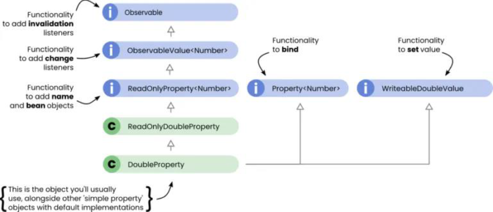

# Java Lambda, Function Interface, Property Binding

## Java lambda

### Why we need Java Lambda?

1.Due to the multi-core CPU rising, programming algorithms locks error prone and time consuming. (java util concurrent package has numerous methods to help write parallel programming codes)

2.Java 8 Lambda allows us to write complex collection processing logics and call the method so it efficiently runs on multi-core CPU.

### Functional Programming?

The feature of passing code to methods and being able to return it and incorporate it into data structure and provides access to whole range of additional techniques are commonly referred to as functional style programming.

Thinking the problem domain in terms of immutable values and functions that translate between them.

### Lambda Intro

The nameless functions like creating objects instead of methods in Java.

The function objects are commonly known as closures in Java.

Functions or closures can be treated like objects so that they can be assigned to variables and passed into other functions.

### Programming thinking has been changed by Lambda

1.Imperative style: That’s what Java has provided us since its inception. (Tell exactly Java what to do)

```java
public class Cities {

  public static void findChicagoImperative(final List<String> cities) {
    booleanfound = false;
    for (String city : cities) {
      if (city.equals("Chicago")) {
        found = true;
        break;
      }
    }
    System.out.println("Found chicago?:" + found);
  }

  public static void main(final String[] args) {
    List<String> cities = Arrays.asList(
      "Albany",
      "Boulder",
      "Chicago",
      "Denver",
      "Eugene"
    );
    findChicagoImperative(cities);
  }
}
```

2.Declarative Style: You tell Java the goal by calling the built in methods from the collection's class.

```java

public class Cities {
    public static void findChicagoDeclarative(final List<String> cities)
    {
        System.out.println("Found chicago?:" + cities.contains("Chicago"));
    }
    
    public static void main(final String[] args) {
        List<String> cities = Arrays.asList("Albany", "Boulder", "Chicago", "Denver", "Eugene");
        findChicagoDeclarative(cities);
    }
}
```

What is good about declarative style?

No messing around with mutable variables.

Iteration steps wrapped under the hood

Less clutter

Better clarity; retains our focus

Less impedance; code closely trails the business intent

Less error prone. Easier to understand and maintain

### Example about before Lambda vs after Lambda

```java

Button btn= new Button();

btn.setOnAction(new EventHandler<ActionEvent>() {
    public void handle(ActionEventevent) {
        System.out.println("Hello World");
    } 
});

```

vs

```java

btn.setOnAction(event -> System.out.println("Hello World") );

```

So much boiler codes are saved because of lambda.

### Lambda Syntax in Java


Further more you could implicitly specify the return *statement* result.

At the same time, you don't need to specify the *return type* as well. Because Lambda does not need to provide the return type because compiler knows.

```java

// explicit return 
(double x, double y) -> { return x * y; }

//implicit return 
(double x, double y) -> { x * y; }

// Don't need to specify the argument type here too
(x,y) -> { x * y;}
 
```

Even better you can have this kind of style:


## function interface

Function Interface (Making the function more portable)

Any Java Functional Interface which contains *one* and only *abstract* method:

The abstract method defined in a functional interface is the contract for any lambdas which will implement the functional interface

```java
// You need the decorator here to specify
@FunctionalInterface
public interface Messenger{
    void notify(String msg, int count);
}

```

Functional interface can be generic interfaces or explicitly typed interfaces

```java
@FunctionalInterface
public interface Something<T,R>{
    R apply(T param);
}

```

Example:

Functional Interface example use case: 1. defined the function in the higher level. 2. Then create the lambda however you want, but you have to follow the function signature inside the class.

```java
// This is like functor, but it is so different from functor. 
@FunctionalInterface
public interface Messenger {
    void notify(String msg, int count);
}
public class NotificationService {
    public static void main(String[] args) {
        // Using a lambda expression to implement the Messenger interface
        Messenger messenger = (msg, count) -> {
            System.out.println("Sending notification: " + msg + " (Count: " + count + ")");
        };
        // Using the messenger to send a notification
        messenger.notify("Hello, world!", 3);
    }
}
```

### Cloud computing respawned a lot of functional programming languages

Declarative style programming could let the instructions send to the distributed nodes instance. Then do the operation over there (in the each instance) e.g. find

But the imperative programming has to bring the data back and then find everything in one nodes instance. That one thread or instance is crippled because of the amount of work.

### Lazy evaluation VS Eager Evaluation

Lazy: The behavior is the same as function callback behavior where invocation is deferred.

Eager: Invocation is triggered right away is called eager.

### Functional Interface Annotator and util function classes

@Functional Interface :
  has no effects on the code but just let the compiler check during the compiler time. Make sure that one and the only method is there.

Java has so many methods inside the util.function package.

*Function*: takes one argument and *produces the results*, used to map one object of one type to another type of object.

*Consumer*: takes one argument and *doesn’t return anything*, used to iterate over multiple objects.

*Predicate*: take one argument and always *returns true or false*, used to perform key filter operations on collections of objects.

Syntax:
  Consumer:

  (T obj)-> returns void; // Just eat no shit function…/
  
  Defines an abstract method named accept that takes an object of generic type T and returns no result.
  
  Your operation could potentially manipulate the T object.

  Predicate:

  (T obj) -> return Boolean;

  Defines an abstract method named test that takes T type object and returns a Boolean.  

  Function:

  (T,R) -> Return R obj

  Defines an abstract method named apply that takes an object of generic type T as input and returns an object of generic type R.

### Method reference

Often when using lambdas, there are methods that take a single parameter as input or a single value as a return type.

Implement the whole method is very redundant, so Java 8 has the method reference.

```java

btn.setOnAction(System.out::println); // WHAT? Scpres?

// scope operator is used to specify which method will be used here
// Missing e-> for simplicity
// missing () for println

// Flow ->  event object e will be implicitly called toString first then pass the String to the println

```

## Java Streams

### Streams intro

Streams allows you manipulate collections of data in a declarative way. (think about those array methods in JS)

They can be considered as iterators (but they are different than C++ iterators).

Pipeline is a sequence of operations that can process or interrogate each element in a stream.

Piplines + Streams allow you to perform aggregate operations (like map, reduce, filter).

```java
// create a list of values
List<Integer> values = Arrays.asList(23, 84, 74, 85, 54, 60);
System.out.println("values: " + values.toString());
// nonlocal variable to be used in lambda expression.
int threshold = 54;
System.out.println("Values greater than " + threshold + " converted to hex:");
Stream<Integer> stream = values.stream();
// using aggregate functions filter() and forEach()
stream
    .filter(val -> val > threshold) /* Predicate functional interface */
    .sorted()
    .map(dec -> Integer.toHexString(dec).toUpperCase() ) /* Consumer functional interface*/
    .forEach(val -> System.out.println(val)); /* each output values	

```

### Stream characteristics

Pipelining: Many stream operations return a stream themselves, allowing operations to be chained form a larger pipeline. (pipe chaining)

Internal iteration: In contrast to collection, which are iterated explicitly using an iterator, stream, operations do the iterations behind the scenes for you. (hide iterating)

Traversable only once: A stream can only be traversed once.

```java
public static void main(String[] args) {

    List<String> title= Arrays.asList("Sky","is","blue");

    Stream<String> a= title.stream();

    a.forEach(System.out::println); // You can only traverse once.

    a.forEach(System.out::println); // will throw an exception
}
```

### Stream can do more than you think

Intermediate operations such as filter, sorted, returns another STREAM as the return type.

Intermediate operations don’t perform any processing until a terminal operation is invoked on the stream pipeline

Terminal operations produce a result from a stream pipeline.


start the logic from create a stream and use the .collect to end it.


## Property binding

### Property binding intro

What is a property in JavaFX? 

  Properties are basically wrapper objects for JavaFX based object attributes such as String, int, etc.
  
  Properties allow you to add listener code to respond when the wrapped value of an object was changed or flagged.

  Properties wire the scene so that the view updates reflected whenever the data is modified.

  (This does sound like angular)

Most JavaFX property objects extend two key interfaces:

  ReadOnlyProperty<> and WriteableValue<>.

  

Read only:
  
  First create wrapper object, then get the TRUE READ ONLY OBJECT. 
  
```java
ReadOnlyStringWrapper userName = new ReadOnlyStringWrapper("jamestkirk");
  
ReadOnlyStringProperty readOnlyUserName = userName.getReadOnlyProperty();
```

### Simple Class wrappers

The class we use for create property:

```md
    SimpleBooleanProperty
    SimpleLongProperty
    SimpleDoubleProperty
    SimpleMapProeprty
    SimpleFloatProeprty
    SimpleObjectProperty
    SimlpeIntegerProperty
    SimpleSetProeprty
    SimpleListProperty
    SimpleStringProperty
```

Constructor can have multiple overloads like

```md
    SimpleIntegerProperty()
    SimpleIntegerProperty(int initialValue)
    SimpleIntegerProperty(Object bean, String name)
    SimpleIntegerProperty(Object bean, String name, int initialValue)

```

Example:

```java

public class User {
  private static final String USERNAME_PROP_NAME = "userName";
  private final ReadOnlyStringWrapper userName;
  private static final String PASSWORD_PROP_NAME = "password";
  private final StringProperty password;
  public User() {
    userName =
      new ReadOnlyStringWrapper(
        this,
        USERNAME_PROP_NAME,
        System.getProperty("user.name")
      );
    password = new SimpleStringProperty(this, PASSWORD_PROP_NAME, "");
  }

  public final String getUserName() {
    return userName.get();
  }

  public ReadOnlyStringProperty userNameProperty() {
    return userName.getReadOnlyProperty();
  }

  public final String getPassword() {
    return password.get();
  }

  public final void setPassword(String password) {
    this.password.set(password);
  }

  public StringProperty passwordProperty() {
    return password;
  }
}
```

### Invalidation Listeners


Invalidates means the when the value changes, the property is invalidated. Then if you have a event handler for this, then the event handlers will be triggered.

Every property in JavaFX extends the observable interface. Meaning they all provide functionality to register listeners that fire when the property invalidates.

```java

// Adding a invalidation listener (anonymous inner class)
xProperty.addListener(new InvalidationListener() {
    @Override
    public void invalidated(Observable o) {
    // code goes here
    }
});

// Adding a invalidation listener (lambda expression)
xProperty.addListener((Observable o) -> {
    // code goes here
});

```
